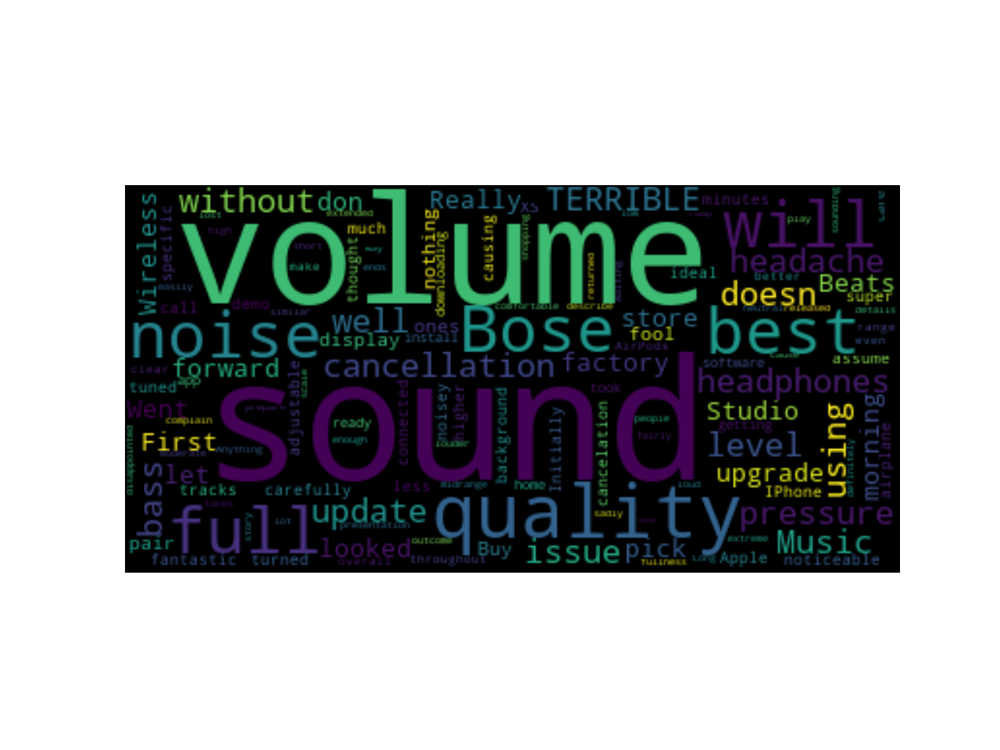

# Headphone_Analysis
  Recently, I really want to buy a Bose n700 noise-canceling headphone. Then, I decided to analysis the headphone. Since I really care about reviews from all the users who already purchased and used the product, I collected all the reviews from Amazon and analyze it. Wish this project can let me make a decision easier.  

* __Step 1 - Scrape a data from Amazom__  
  Using Python's package 'urllib3', 'requests', 'lxml', 'dateutil' to scrape Bose n700 noise cancelling from Amazon page.
 
* __Step 2 - Plot a Word Cloud graph__  
  Using Python's package 'wordcloud' ro create the popular words of the headphones. 
  
  
* __Step 3 - Analyze the reviews' sentiment__  
  Using Python's machine learning package 'textblob' to find a sentiment in each review.
  
  
  

# Conclusion
  After visualizing the data, I can easily observe that the reviews of the Bose n700 noise-canceling headphone are mostly possitive. Therefore, I am willing to have one!
